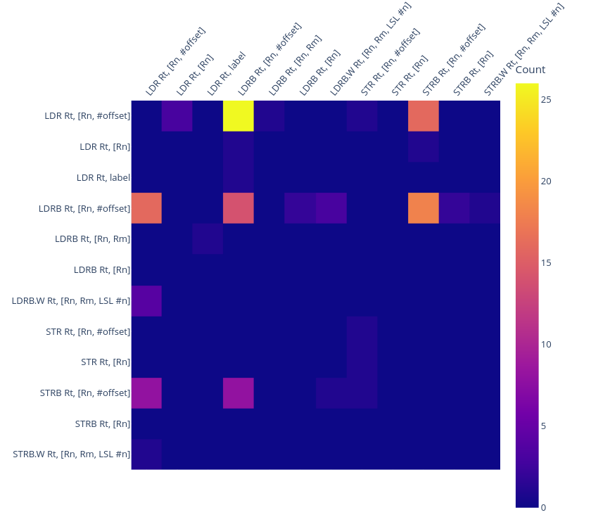

## **About**:
ACID is a tool meant to give insight into the memory instruction patterns used in (cryptographic) functions used in ARMv7-m firmware.

By using Ghidra to do the heavy lifting we can easily select functions of interest from an elf binary and graph the instruction patterns found in those functions.

### *Example instruction pattern graph:*

## **Installation**:
The tool itself is just an interactive jupyter notebook and a helper script, but we will need to install some dependencies before we can use it.
### Install Ghidra SRE:
All the disassembly and resolving symbols is done by Ghidra in the background so we will install that first.

The latest Ghidra installation guide can be found [[here]](https://htmlpreview.github.io/?https://github.com/NationalSecurityAgency/ghidra/blob/stable/GhidraDocs/InstallationGuide.html).

### Install pyhidra:
The glue between Ghidra's flat-API and is called pyhidra.
The source and installation instructions can be found [[here]](https://github.com/dod-cyber-crime-center/pyhidra).

**Note:**  At this time enabling the plugin trough *File -> Configure -> Experimental* doesn't work! You can use: `python -m pyhidra.install\_plugins ` followed by starting Ghidra as a workaround.
### Install Jupyter Lab and remaining Python libraries:
Because Jupiter and the other library's don't need any manual steps you can complete the installation trough: 
`pip install jupyterlab ipywidgets tqdm plotly traitlets`

## **Usage:**
### Collect targets:
The first step is to collect the binary's you want to analyze, any ARMv7 binary will do but having debug symbols and descriptive function names will make it much easier. Place them in a folder and point the tool to that folder, the default location is the `targets` folder.

### Select functions to analyze:
Using jupyter widgets you can select functions of interest.

### Configure settings:
By default all instructions are taken into account and the pattern length is 3 (because the ARMv7-m pipeline has 3 stages) but you can select specific instructions. Or for exemple search for patterns of 4 instructions where at least 2 instructions are LDR with an immediate offset.

### Look at the graphs:
Now we told the tool what we are interested in, it will show interactive figures based on what it found.

**Instruction pattern graph:**

**Instruction combination heat map:**

### Make changes!
It's all just python, by adding different graphs to the `generate_report` function, or adding processing to other steps you can make it more useful for your particular project.

